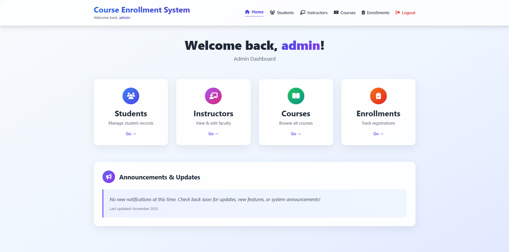
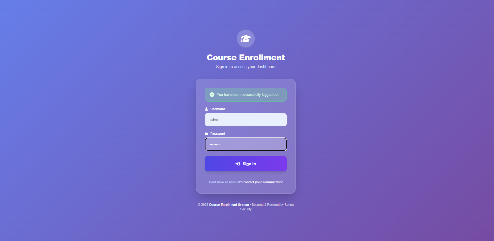
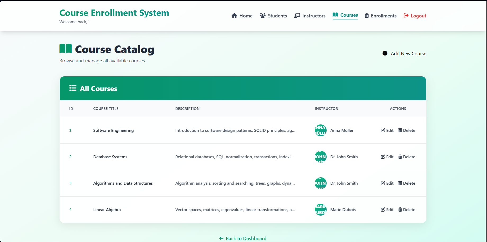
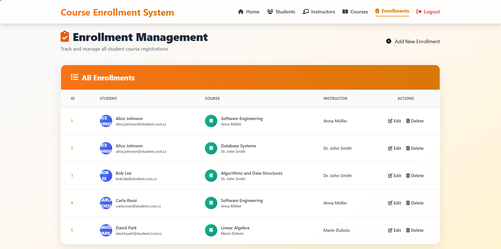
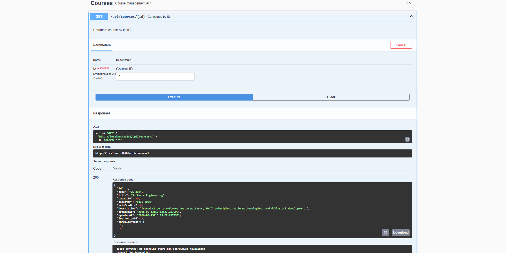
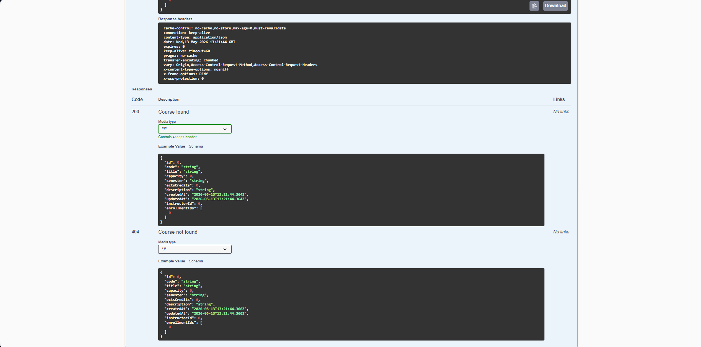
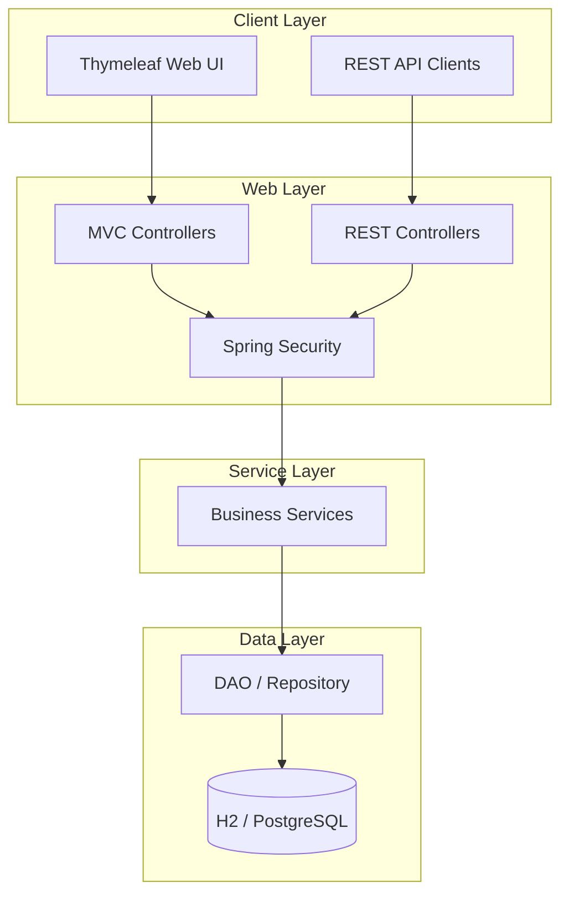

# Course Enrollment System

[](https://www.java.com/)
[](https://spring.io/projects/spring-boot)
[](https://spring.io/projects/spring-security)
[](https://www.postgresql.org/)
[](https://www.thymeleaf.org/)
[](https://www.docker.com/)
[](LICENSE)

A full-stack Spring Boot application for managing courses, students, instructors, and enrollments. The project includes a Thymeleaf MVC web interface, a documented REST API, authentication, database persistence, Docker support, and test coverage.

## Table of Contents

- [Overview](#overview)
- [Screenshots](#screenshots)
- [Features](#features)
- [Tech Stack](#tech-stack)
- [Architecture](#architecture)
- [Getting Started](#getting-started)
- [API Documentation](#api-documentation)
- [Project Structure](#project-structure)
- [Troubleshooting](#troubleshooting)
- [Roadmap](#roadmap)

## Overview

Course Enrollment System models a university-style enrollment workflow. It supports managing students, instructors, courses, and enrollment records through both server-rendered pages and REST endpoints.

The application follows a layered Spring architecture:

- Controllers handle MVC and REST requests.
- Services contain business logic.
- DAO and repository classes handle persistence.
- DTOs separate API contracts from JPA entities.
- Spring Security protects the web application.

The default local setup uses an H2 in-memory database for fast development. A PostgreSQL-backed Docker setup is also included for a production-like environment.

## Screenshots

### Dashboard



### Main Views

| Login | Courses |
|:---:|:---:|
|  |  |

| Enrollments | Swagger UI |
|:---:|:---:|
|  |  |

### API Schema



## Features

### Web Application

- Thymeleaf-based MVC pages
- Login and logout flow with Spring Security
- Course, student, instructor, and enrollment management views
- Form validation with Bean Validation
- Static CSS and JavaScript assets

### Course Management

- Create, read, update, and delete courses
- Assign instructors to courses
- Find courses by ID, code, instructor, or capacity status

### Enrollment Management

- Create and update enrollment records
- Track enrollment lifecycle states
- Query enrollments by student or course
- Prevent duplicate student-course enrollment checks through the API

### Users and Security

- Custom user details service and authentication provider
- BCrypt password hashing
- Session-backed login state
- Seeded local users for development

### API and Documentation

- REST API for courses, students, instructors, and enrollments
- OpenAPI documentation with Swagger UI
- Request and response schemas generated by SpringDoc

### Quality and DevOps

- Gradle build
- JUnit and Spring Boot tests
- Spring Security test support
- JaCoCo coverage reports
- Dockerfile and docker-compose setup
- PostgreSQL and H2 database support
- Liquibase dependency and changelog structure

## Tech Stack

| Area | Technology |
| --- | --- |
| Language | Java 17 |
| Framework | Spring Boot 3.2.4 |
| Web | Spring MVC, Thymeleaf |
| Security | Spring Security, BCrypt, Spring Session JDBC |
| API Docs | SpringDoc OpenAPI, Swagger UI |
| Persistence | Spring Data JPA, Hibernate |
| Databases | H2, PostgreSQL 16 |
| Migrations | Liquibase |
| Mail | Spring Boot Starter Mail |
| Testing | JUnit, Spring Boot Test, Spring Security Test |
| Coverage | JaCoCo |
| Build Tool | Gradle |
| Deployment | Docker, docker-compose |

## Architecture



## Getting Started

### Prerequisites

- Java 17 or newer
- Gradle, or the included Gradle wrapper
- Docker and Docker Compose, if you want to run with PostgreSQL

### Run with Docker

```bash
docker-compose up --build
```

This starts:

- PostgreSQL on port `5432`
- The Spring Boot application on `http://localhost:8080`

Docker database defaults:

| Property | Value |
| --- | --- |
| Database | `coursedb` |
| User | `courseuser` |
| Password | `coursepass` |

### Run Locally with H2

On macOS or Linux:

```bash
./gradlew bootRun
```

On Windows:

```bash
gradlew.bat bootRun
```

Local URLs:

| Service | URL |
| --- | --- |
| Application | `http://localhost:8080` |
| H2 Console | `http://localhost:8080/h2-console` |
| Swagger UI | `http://localhost:8080/swagger-ui` |
| OpenAPI JSON | `http://localhost:8080/v3/api-docs` |

### Default Development Users

The application creates these users on startup if they do not already exist:

| Username | Password | Role |
| --- | --- | --- |
| `admin` | `admin123` | `ADMIN` |
| `subadmin` | `subadmin123` | `SUBADMIN` |

### Run Tests

```bash
./gradlew test
```

Generate the JaCoCo coverage report:

```bash
./gradlew jacocoTestReport
```

Coverage output:

```text
build/customJacocoReportDir/jacocoHtml/index.html
```

## API Documentation

After starting the application, open Swagger UI:

```text
http://localhost:8080/swagger-ui
```

Main REST resources:

| Resource | Base Path | Supported Operations |
| --- | --- | --- |
| Courses | `/api/courses` | List, find, create, update, delete |
| Students | `/api/students` | List, find, create, update, delete |
| Instructors | `/api/instructors` | List, find, create, update, delete |
| Enrollments | `/api/enrollments` | List, find, create, update, delete |

Additional query endpoints include:

- `/api/courses/code/{code}`
- `/api/courses/instructor/{instructorId}`
- `/api/courses/full`
- `/api/students/email/{email}`
- `/api/instructors/email/{email}`
- `/api/enrollments/student/{studentId}`
- `/api/enrollments/course/{courseId}`
- `/api/enrollments/exists/student/{studentId}/course/{courseId}`

## Project Structure

```text
src/main/java/com/example/courseenrollmentsystem/
|-- configuration/          Security and OpenAPI configuration
|-- controller/             Thymeleaf MVC controllers
|   `-- api/                REST controllers
|-- dao/                    DAO interfaces and implementations
|-- dataModel/              JPA entities
|   `-- enums/              Domain enums
|-- dto/                    Data Transfer Objects
|-- repository/             Spring Data JPA repositories
|-- security/               Authentication and user details
`-- service/                Business services and implementations

src/main/resources/
|-- db/changelog/           Liquibase changelog files
|-- static/                 CSS, JavaScript, and static assets
|-- templates/              Thymeleaf templates
`-- application.properties  Local application configuration
```

## Configuration Notes

- The default configuration uses H2 in-memory storage, so local data is reset when the app restarts.
- Docker Compose overrides the datasource settings to use PostgreSQL.
- Liquibase is currently disabled by default with `spring.liquibase.enabled=false`.
- Email support requires SMTP properties before mail sending can be used.
- The REST API is currently permitted in security configuration for easier local development.

## Troubleshooting

### Port 8080 is already in use

Change the application port in `src/main/resources/application.properties`:

```properties
server.port=8081
```

### Docker build or startup fails

Make sure Docker Desktop is running, then recreate the containers:

```bash
docker-compose down -v
docker-compose up --build
```

### PostgreSQL connection refused

Check whether the database container is running:

```bash
docker ps
```

Also verify that the credentials in `docker-compose.yml` match the datasource environment variables used by the `app` service.

## Roadmap

- Add pagination and filtering to list endpoints
- Add email verification for user registration
- Add audit fields for created and updated records
- Add Testcontainers-based integration tests
- Add refresh token support for OAuth2 flows
- Add Kubernetes deployment manifests
- Build a separate SPA client for the REST API

## Author

**Aylin Kars**

Czech Technical University in Prague, Faculty of Information Technology

[GitHub](https://github.com/karsayli)

## License

This project is licensed under the MIT License. See [LICENSE](LICENSE) for details.
