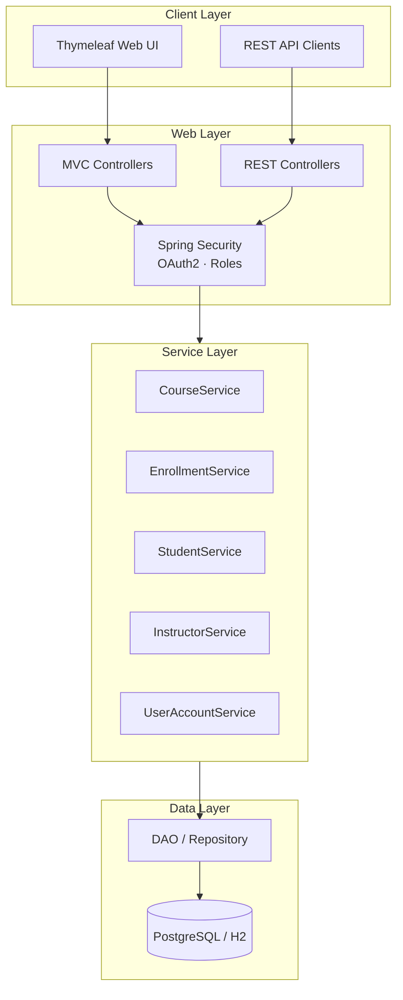

# Course Enrollment System

[](https://www.java.com/)
[](https://spring.io/projects/spring-boot)
[](https://spring.io/projects/spring-security)
[](https://www.postgresql.org/)
[](https://www.thymeleaf.org/)
[](https://www.docker.com/)
[](LICENSE)

> Full-stack **Spring Boot** application for managing students, instructors, courses, and enrollments — with a Thymeleaf MVC UI and a documented REST API.

---

## 📖 About

Course Enrollment System is a full-stack web application for managing university-style course operations: creating courses, registering students and instructors, and handling enrollments through their full lifecycle.

The project follows a clean **layered architecture** (Controller → Service → DAO/Repository) and exposes both a **Thymeleaf-based MVC UI** and a **REST API** documented with **OpenAPI/Swagger**. Authentication and role-based authorization are handled by **Spring Security + OAuth2**, with schema migrations managed by **Liquibase** and session storage backed by **Spring Session JDBC**.

## 🏗️ Architecture



The system enforces role-based access (Admin / Instructor / Student) and uses DTOs to decouple the persistence model from the API contracts.

## 🖼️ Screenshots

> _Add screenshots in `docs/screenshots/` and reference them here_

| Login | Course List | Enrollment Form |
|:---:|:---:|:---:|
| _coming soon_ | _coming soon_ | _coming soon_ |

## ✨ Features

### 👥 User & Access Management
- User registration and authentication
- Role-based authorization (Admin · Instructor · Student)
- OAuth2 client + Authorization Server support
- Persistent sessions via Spring Session JDBC

### 🎓 Course & Enrollment Management
- Full CRUD operations for Courses, Instructors, Students
- Enrollment lifecycle management (ENROLLED / DROPPED / COMPLETED)
- Instructor ranking (Lecturer · Assistant Professor · Professor)
- Student status tracking (Active · Graduated · Suspended)

### 🌐 Web & API
- Thymeleaf MVC UI with Spring Security integration
- Documented REST API (OpenAPI / Swagger UI)
- Form validation with Bean Validation
- Email notifications via Spring Mail

### 🧪 Quality & DevOps
- Unit & integration tests with JUnit and Spring Security Test
- Code coverage reporting with JaCoCo
- Liquibase database migrations
- Dockerized with PostgreSQL via docker-compose

## 🛠️ Tech Stack

| Layer | Technology |
|-------|-----------|
| **Language** | Java 17 |
| **Framework** | Spring Boot 3.2.4 |
| **Security** | Spring Security · OAuth2 Client · OAuth2 Authorization Server |
| **Persistence** | Spring Data JPA · Hibernate |
| **Database** | PostgreSQL 16 (prod) · H2 (dev) |
| **Migrations** | Liquibase |
| **Session** | Spring Session JDBC |
| **View Layer** | Thymeleaf · Thymeleaf Extras Spring Security |
| **API Docs** | SpringDoc OpenAPI / Swagger UI |
| **Mail** | Spring Boot Starter Mail |
| **Testing** | JUnit · Spring Boot Test · Spring Security Test · JaCoCo |
| **Build** | Gradle |
| **Deployment** | Docker · docker-compose |

## 🚀 Quick Start

### With Docker (recommended)

```bash
docker-compose up --build
```

This starts both the PostgreSQL database and the Spring Boot application. Access the app at **http://localhost:8080**.

### Without Docker

```bash
./gradlew bootRun         # macOS/Linux
gradlew.bat bootRun       # Windows
```

By default the app uses an in-memory **H2** database for development.

## ⚙️ Detailed Setup

### Prerequisites
- Java 17+
- Gradle (or use the included Gradle wrapper `gradlew`)
- Docker & docker-compose (optional, for containerized run)
- PostgreSQL 16 (optional, if not using Docker)

### Local Development (H2 in-memory)

```bash
./gradlew bootRun
```

- App: **http://localhost:8080**
- H2 Console: **http://localhost:8080/h2-console**
- Swagger UI: **http://localhost:8080/swagger-ui**

### Production-like Run (PostgreSQL via Docker)

```bash
docker-compose up --build
```

Default credentials (configurable in `docker-compose.yml`):
```
DB:       coursedb
User:     courseuser
Password: coursepass
```

### Run Tests

```bash
./gradlew test
```

Generate a JaCoCo coverage report:

```bash
./gradlew jacocoTestReport
# Report: build/customJacocoReportDir/jacocoHtml/index.html
```

## 📡 API Documentation

Once the app is running, interactive API documentation is available at:

- **Swagger UI:** http://localhost:8080/swagger-ui
- **OpenAPI JSON:** http://localhost:8080/v3/api-docs

### Main REST Endpoints

| Resource | Endpoints |
|----------|-----------|
| Courses | `GET / POST / PUT / DELETE  /api/courses` |
| Enrollments | `GET / POST / PUT / DELETE  /api/enrollments` |
| Instructors | `GET / POST / PUT / DELETE  /api/instructors` |
| Students | `GET / POST / PUT / DELETE  /api/students` |

## 🗂️ Project Structure

```
src/main/java/com/example/courseenrollmentsystem/
├── configuration/        # Security & OpenAPI configuration
├── controller/           # Thymeleaf MVC controllers
│   └── api/              # REST controllers
├── service/              # Business logic
├── dao/                  # Data Access Objects (interfaces + impl)
├── repository/           # Spring Data JPA repositories
├── dataModel/            # JPA entities (Course, Student, ...)
│   └── enums/            # Domain enums (Status, Role, Rank)
├── dto/                  # Data Transfer Objects
└── security/             # CustomUserDetails & auth provider

src/main/resources/
├── templates/            # Thymeleaf HTML templates
├── static/               # CSS / JS / static assets
├── db/changelog/         # Liquibase migrations
└── application.properties
```

## 📝 Notes & Current Limitations

- The default profile uses an **in-memory H2** database — data is lost on restart
- Liquibase is **disabled by default** in `application.properties`; enable it for managed migrations
- Email functionality requires SMTP configuration in `application.properties`
- OAuth2 Authorization Server is configured but requires client registration for external use

## 🐛 Troubleshooting

<details>
<summary><b>Port 8080 already in use</b></summary>

Change the port in `src/main/resources/application.properties`:
```properties
server.port=8081
```
</details>

<details>
<summary><b>Docker build fails</b></summary>

- Make sure Docker Desktop is running
- Try cleaning old containers: `docker-compose down -v && docker-compose up --build`
</details>

<details>
<summary><b>PostgreSQL connection refused</b></summary>

- Verify the `db` container is healthy: `docker ps`
- Check `docker-compose.yml` credentials match what the app expects
</details>

## 🚧 Future Improvements

- Frontend SPA (React / Vue) consuming the REST API
- Pagination and filtering on list endpoints
- Email verification on user registration
- Audit logging (created/modified by/at)
- Comprehensive integration tests with Testcontainers
- Kubernetes deployment manifests
- Refresh token support for OAuth2

## 👤 Author

**Aylin Kars**
Czech Technical University in Prague — FIT
🔗 [GitHub](https://github.com/karsayli)

## 📄 License

This project is licensed under the **MIT License** — see the [LICENSE](LICENSE) file for details.
